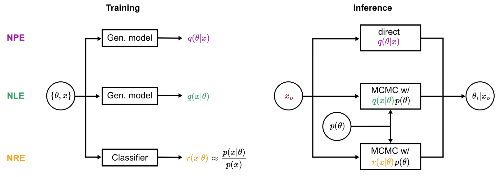

# Introduction

After learning about Neural Posterior Estimation (NPE) in Sessions 2-3, you've seen that NPE is not the only approach to simulation-based inference. This guide provides practical recommendations for choosing between the three core SBI methods:

- **NPE** (Neural Posterior Estimation): Learns the posterior $q_\phi(\theta|x) \approx p(\theta|x)$
- **NLE** (Neural Likelihood Estimation): Learns the likelihood $q_\phi(x|\theta) \approx p(x|\theta)$
- **NRE** (Neural Ratio Estimation): Learns the likelihood-to-evidence ratio $r_\phi(\theta, x) \approx \frac{p(x|\theta)}{p(x)}$

## Overview of SBI Methods

All three methods share the same workflow: train on simulated data $\{(\theta_i, x_i)\}$, then evaluate on observed data $x_o$ to obtain the posterior. However, they differ in:

1. **What they learn** (posterior, likelihood, or ratio)
2. **How inference is performed** (direct sampling vs. MCMC/VI)
3. **Their computational trade-offs**

## Method Comparison

| Criterion | NPE | NLE | NRE |
|-----------|:---:|:---:|:---:|
| **Inference speed** | ++ (ms) | − (sec-min) | − (sec-min) |
| **Simulation efficiency for i.i.d. data** | −− | ++ | ++ |
| **Embedding network compatibility** | ++ | −− | ++ |
| **Training computational cost** | Medium | Medium | Low |
| **Invalid simulation handling** | ++ | − | − |
| **Hyperparameter tuning complexity** | Low | High | High |

*Legend:* ++ strong advantage, + moderate advantage, − moderate disadvantage, −− strong disadvantage

## Key Considerations

### 1. Inference Speed

**NPE** provides direct posterior sampling via a single forward pass (milliseconds). This is crucial for:

- Real-time applications
- Analyzing many observations (e.g., thousands of experimental subjects)
- Running extensive diagnostics (SBC requires many posterior evaluations)

**NLE/NRE** require MCMC or VI after training, taking seconds to minutes per observation. Computational cost scales as $O(d \cdot n_{\text{samples}} \cdot n_{\text{chains}})$ where $d$ is parameter dimension.

> **Guidance:** If you need inference for >100 observations or sub-second inference, strongly consider NPE.

### 2. High-Dimensional Data & Embedding Networks

**NPE and NRE** take data $x$ as input, enabling end-to-end training with embedding networks:

- CNNs for images
- RNNs/Transformers for time series
- GNNs for relational data

**NLE** takes parameters $\theta$ as input to predict $x$, fundamentally limiting its ability to use embedding networks. Workarounds (pre-computed summary statistics) typically underperform end-to-end learning.

> **Guidance:** For high-dimensional raw data (images, time series, graphs), use NPE or NRE.

### 3. i.i.d. Observations (Trial-Based Data)

Many experiments produce multiple independent observations from the same parameters (e.g., multiple trials per subject in psychology experiments).

**NLE and NRE** excel here because:

- Train on single observations
- Combine evidence efficiently: $p(\theta|x_1, \ldots, x_N) \propto \prod_{i=1}^{N} p(x_i|\theta) \cdot p(\theta)$
- No retraining needed for different numbers of observations

**NPE** requires:

- Training on datasets with multiple simulations per parameter set
- Permutation-invariant architectures
- Retraining if trial numbers change significantly

> **Guidance:** For i.i.d. observations, prefer NLE or NRE unless you need amortized inference across many different datasets.

### 4. Invalid Simulations

Simulators often fail for certain parameter combinations (numerical instabilities, non-physical configurations).

**NPE** can simply discard invalid simulations—it learns $p(\theta|x)$ only from valid pairs.

**NLE/NRE** must explicitly model invalid simulations or risk systematic bias toward parameter regions with failures.

> **Guidance:** If simulator failures occur for >1% of parameters, prefer NPE.

### 5. Hyperparameter Tuning

**NPE** requires tuning only neural network hyperparameters (architecture, learning rate, etc.).

**NLE/NRE** additionally require tuning MCMC/VI:

- Sampler type (HMC, NUTS, slice sampling)
- Step sizes, number of chains, warmup steps
- VI family, convergence criteria

Poor MCMC/VI settings can produce biased posteriors even with a perfectly trained network.

> **Guidance:** Budget significant time for MCMC/VI tuning with NLE/NRE. Use tools like [ArviZ](https://python.arviz.org/) to diagnose sampling issues.

**Note on hyperparameter optimization:** For all methods, systematic hyperparameter tuning can significantly improve performance. Use a held-out validation set to guide architecture choices (number of layers, hidden units, flow transforms) and training parameters (learning rate, batch size). Tools like [Optuna](https://optuna.org/) or [Weights & Biases](https://wandb.ai/) can automate this process. For NPE, minimizing validation loss provides a principled objective since it upper-bounds the KL divergence to the true posterior.

## Practical Recommendations

### Start with NPE

Begin with NPE using normalizing flows unless your use case clearly favors another method. NPE's combination of fast inference, implementation simplicity, and robust handling of simulator failures makes it suitable for most applications.

### When to Use NLE

Choose NLE primarily for **i.i.d. observation settings** where:

1. Simulation is expensive
2. Number of observations varies significantly across subjects/conditions
3. You can afford MCMC computational cost

*Common applications:* cognitive modeling, population genetics, repeated measurements in physics.

### When to Use NRE

Consider NRE for similar settings as NLE but when:

- Training computational budget is highly constrained (classifier is simpler than generative model)
- You only need to compare hypotheses rather than full posterior

### When to Use Sequential Methods

If you have **expensive simulations** and need inference for a **single observation**, sequential variants (SNPE, SNLE, SNRE) can reduce simulation costs by 10× or more. However:

- They require careful convergence monitoring
- They lose amortization (specialized for one $x_o$)
- Diagnostics become computationally prohibitive

### Validation Through Multiple Methods

When possible, implement multiple methods for important applications. Agreement between NPE and NLE/NRE provides evidence for reliable inference; disagreement can reveal issues with simulator design or implementation.

## Summary Table: When to Use Each Method

| Scenario | Recommended Method |
|----------|-------------------|
| General use, many observations | NPE |
| Real-time / high-throughput inference | NPE |
| High-dimensional data (images, time series) | NPE or NRE |
| i.i.d. trial-based data | NLE or NRE |
| Expensive simulations, single observation | SNPE or SNLE |
| Frequent simulator failures | NPE |
| Hypothesis comparison only | NRE |
| Low training budget | NRE |

## References

- Deistler, M., Boelts, J., et al. (2025). *Simulation-Based Inference: A Practical Guide*. arXiv:2508.12939.
- Papamakarios, G. & Murray, I. (2016). Fast ε-free inference of simulation models with Bayesian conditional density estimation. *NeurIPS*.
- Papamakarios, G., Sterratt, D., & Murray, I. (2019). Sequential neural likelihood. *AISTATS*.
- Hermans, J., Begy, V., & Louppe, G. (2020). Likelihood-free MCMC with amortized approximate ratio estimators. *ICML*.
- Boelts, J., Deistler, M., et al. (2024). sbi reloaded: A toolkit for simulation-based
  inference workflows. *JOSS*.
